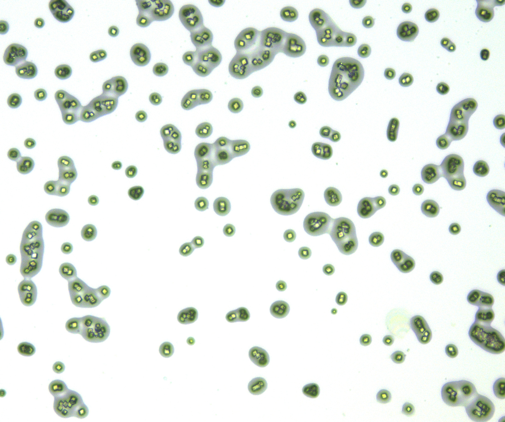
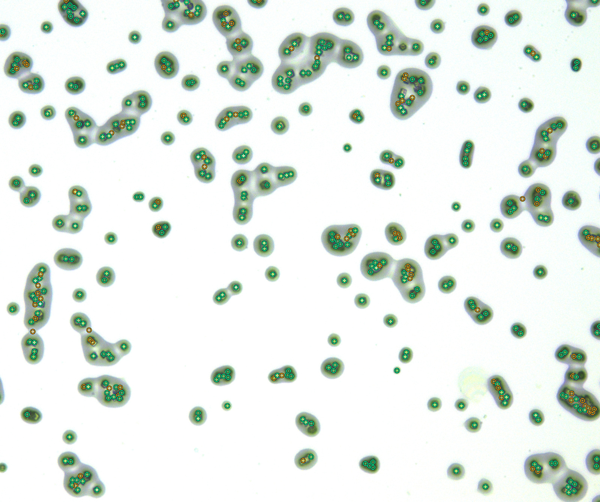

# 方形颗粒计数 · Square Particle Counter

在自己的电脑上批量处理显微颗粒图片，查看标注、逐点复核，并导出计数结果。程序使用 v4 本地模型，界面在浏览器打开，图片在本机处理。

## 计数前后对比

同一张图片 `0-10-1.jpg` 的原图与 v4 自动标注结果：

| 计数前：原图 | 计数后：自动标注 |
|---|---|
|  |  |

本例输出 **438 个候选，其中 98 个待复核**，另自动排除 40 个候选。绿色和橙色标记均已计入计数，橙色表示待复核。展示图依据实际输出坐标绘制，并加粗标记以便查看。该图未参与模型训练，示例结果尚未经人工复核。

## 下载免安装程序

请从 **[Releases 下载页](https://github.com/yangr8640-eng/square-particle-counter/releases/latest)** 下载对应 ZIP，完整解压后启动。GitHub 的 `Code → Download ZIP` 是源码，不是免安装程序。

| 系统 | 下载 | 解压后双击 |
|---|---|---|
| Windows 10/11，64 位 Intel/AMD | [Windows x64](https://github.com/yangr8640-eng/square-particle-counter/releases/download/v1.0.0/ParticleCounter-Windows-x64-v4.zip) | `Start-Windows.bat` |
| macOS 14+，M 系列芯片 | [Mac Apple Silicon](https://github.com/yangr8640-eng/square-particle-counter/releases/download/v1.0.0/ParticleCounter-macOS-AppleSilicon-v4.zip) | `Start-macOS.command` |
| macOS 14+，Intel 芯片 | [Mac Intel](https://github.com/yangr8640-eng/square-particle-counter/releases/download/v1.0.0/ParticleCounter-macOS-Intel-v4.zip) | `Start-macOS.command` |

ZIP 自带 Python、模型和依赖，无需另装 Python，也无需联网。保持启动窗口打开；若浏览器没有自动打开，复制启动窗口中的本机地址。退出时在启动窗口按 `Ctrl+C`。

当前应用版本为 **1.0.0**，算法模型版本为 **v4**。文件校验值见 [SHA256SUMS.txt](SHA256SUMS.txt)。

## 使用

1. 选择或拖入 JPG、PNG、TIFF、BMP 图片，支持多图上传。
2. 点击“开始计数”，查看每张图片的候选数、待复核数、自动排除数与补漏建议。
3. 打开复核页，检查橙点和灰点，按需删除、恢复、补点或撤销。
4. 在复核页导出人工修正 JSON；首页 ZIP/CSV/JSON 保存的是自动结果。
5. 退出前下载结果。默认临时任务会在退出时清理，下载的 ZIP 包含本批原图、标注图和可离线打开的复核页。

橙点已计入计数。灰色模型排除项和补漏建议未计入，可以恢复。普通图片上传不会自动成为训练样本。

## 模型效果与适用范围

v4 使用局部像素与二维空间特征，以及 ExtraTrees 分类器。相对 v3，在同一套 57 张图片的整图分组开发验证中：

| 指标 | v3 | v4 |
|---|---:|---:|
| 计入误检 FP | 2,898 | 2,308 |
| 相对人工点集的精确率 | 94.12% | 95.26% |
| 相对人工点集的召回率 | 99.92% | 99.90% |
| 每图计数平均绝对误差 | 50.40 | 39.89 |
| 待复核候选 | 7,793 | 6,894 |

自动排除的 601 个候选中，590 个与人工删除一致，11 个应保留。这是开发阶段的模型和阈值选择结果，**不是独立新图准确率，也不保证每张图达到相同水平**。详细说明见 [MODEL_CARD.txt](MODEL_CARD.txt)。

适用于与训练样本相近的颗粒形态、成像方式和像素尺度。更换倍率、染色或设备后，应先抽样复核。计数结果需结合原图确认。

## 运行验证

- Apple Silicon 包已实际运行上传、推理、复核和下载流程。
- Intel Mac 包已通过 Rosetta 实际运行；未在 Intel 实机测试。
- Windows 下载包已在 GitHub 的 Windows 运行环境中通过实际模型加载、合成图片推理、上传与离线结果导出检查，见 [通过的验证记录](https://github.com/yangr8640-eng/square-particle-counter/actions/runs/34810490946)。这项检查验证程序运行，不评价真实显微图片的准确率。

Mac 分发包尚未进行 Apple 开发者签名或公证。首次运行若被系统拦截，请先确认文件来源，再使用系统提供的确认入口。

## 从源码运行

需要 Python 3.12。仓库已包含运行所需的 v4 模型。

macOS / Linux：

```sh
python3.12 -m venv .venv
.venv/bin/python -m pip install -r requirements.txt
.venv/bin/python -X utf8 -m local_app
```

Windows（PowerShell）：

```powershell
py -3.12 -m venv .venv
.\.venv\Scripts\python.exe -m pip install -r requirements.txt
.\.venv\Scripts\python.exe -X utf8 -m local_app
```

固定运行入口为 `local_app/model/`。如需指定模型，可使用 `--model`；`--no-browser` 禁止自动打开浏览器，`--port` 可指定本机端口。

开发测试需要 Node.js 执行复核页面的 JavaScript 检查；Node.js 不是运行程序的依赖：

```sh
python -X utf8 -m unittest local_app.test_api scripts.test_runtime
```

## 内容与反馈

仓库提供应用源码、推理算法、运行模型、效果示例和合成测试；运行环境随 Releases 的程序包提供。训练图片和人工标注数据不在此仓库中。

遇到问题可[提交 Issue](https://github.com/yangr8640-eng/square-particle-counter/issues)，注明系统、程序版本和错误信息。第三方组件许可说明见 [THIRD_PARTY_NOTICES.txt](THIRD_PARTY_NOTICES.txt)，完整运行环境保留了各组件的许可文件。
